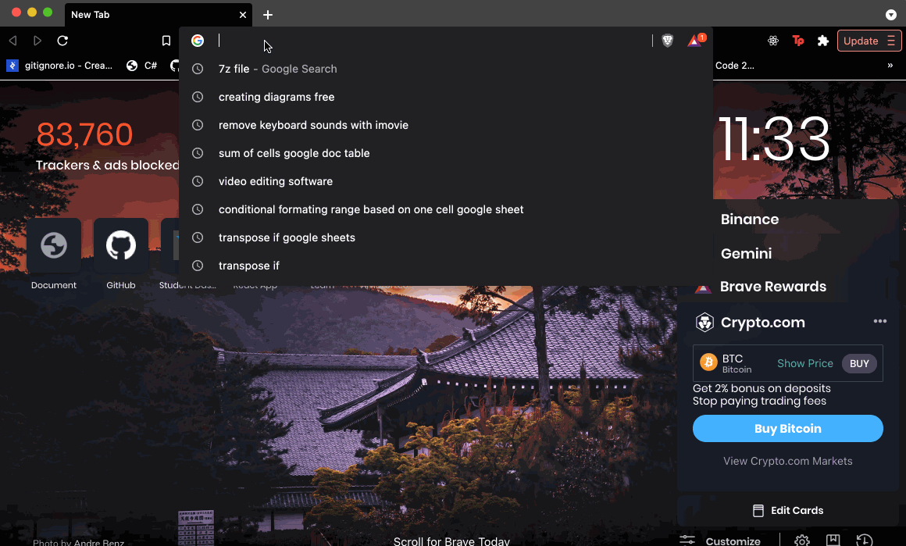

# HTML Table

## Coding Dojo Core Assignment 07.04.2022

<br/>



Getting comfortable with iterating through a list of dictionaries is very important for all web development! Records returned from a database will almost always be in this format.

Create the following list of dictionaries and have it available for your route.

```py
users = [
   {'first_name' : 'Michael', 'last_name' : 'Choi'},
   {'first_name' : 'John', 'last_name' : 'Supsupin'},
   {'first_name' : 'Mark', 'last_name' : 'Guillen'},
   {'first_name' : 'KB', 'last_name' : 'Tonel'}
]
```

Pass users to your template and have your template output an HTML table like this:

| First Name | Last Name | Full Name |
|---|---|---|
| Michael | Choi | Michael Choi |
| John | Supsupin | John Supsupin |
| Mark | Guillen | Mark Guillen |

<br/>

As you need to get into the habit of making your assignment look nice, we challenge you to use either [Bootstrap](https://getbootstrap.com/) or [Foundation](https://foundation.zurb.com/). If you haven't dabbled with these frameworks, start by learning just enough to do this assignment (creating a nice looking table).


<br/>
<br/>

## **Step**

* Start a new Flask project
* Create a route in which the data above is declared and then sent to the template engine to be rendered
* Create the template that displays the data in a table
* NINJA BONUS: Use a framework to format the table